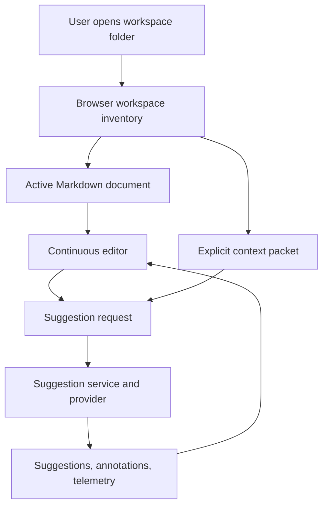
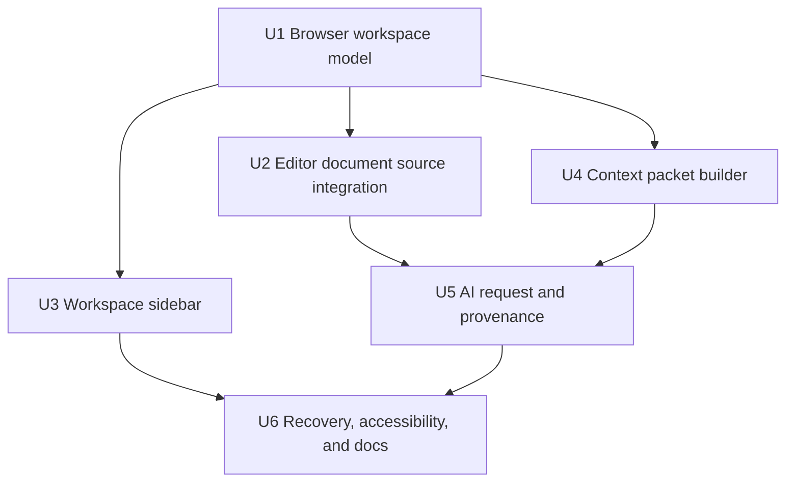

# Add local workspace context

## Summary

Implement the local workspace loop as a Chromium-first browser feature: the frontend owns folder access through browser-granted file handles, while the server continues to own AI suggestions, annotations, telemetry, and insights. The plan adds a bounded Markdown inventory, an active document selector, an explicit context sidebar, context-aware suggestion requests, and request provenance without copying drafts into `docs/sample.md`.

---

## Problem Frame

The app currently starts from a repo-local document path and still carries the prototype assumption that the draft can be loaded from the server's `docs/` area. That breaks the target writing workflow: the active draft and its useful grounding notes already live together in a local writing folder, and the AI reviewer needs selected notes as deliberate context rather than hidden workspace memory (see origin: `docs/brainstorms/2026-05-17-local-workspace-context-requirements.md`).

---

## Requirements

- R1. Support a Chromium-family browser workspace mode that uses user-granted directory access and falls back cleanly when unsupported.
- R2. Inventory only visible Markdown-like files from the selected workspace under a bounded v1 scan rule.
- R3. Let the writer select and save the active Markdown draft from the workspace without copying it into `docs/`.
- R4. Keep suggestions, annotations, telemetry, and insights scoped to a stable document identity for the active workspace document.
- R5. Add a left workspace sidebar that separates file navigation from explicit AI context selection.
- R6. Build and send a bounded selected-context packet with visible whole/trimmed/omitted status before AI requests.
- R7. Preserve request provenance for included context without storing absolute paths, full prompt payloads, or full context excerpts by default.
- R8. Preserve the existing no-context and default-document flow when no workspace is active.
- R9. Surface permission loss, unreadable files, oversized context, unsupported browsers, unsaved edits, and in-flight request switching as recoverable states.
- R10. Keep this feature focused on writing review rather than workspace-wide search, hidden memory, vault management, or desktop packaging.

**Origin actors:** A1 Writer, A2 Writing Copilot, A3 AI reviewer

**Origin flows:** F1 Open a local workspace, F2 Choose the active draft, F3 Select grounding context, F4 Request context-grounded feedback

**Origin acceptance examples:** AE1 unsupported browser fallback; AE2 folder-open inventory; AE3 permission recovery; AE4 review-state separation; AE5 active doc not auto-context; AE6 context persists across draft switches; AE7 context-grounded provocations; AE8 provenance without influence overclaiming; AE9 no-context fallback; AE10 AI data boundary

---

## Scope Boundaries

- No Tauri, Electron, or native-shell packaging in this iteration.
- No workspace-wide semantic search, embeddings, backlinks, graph views, or automatic related-note discovery.
- No saved context sets, reusable workspace libraries, cross-session workspace persistence, or context analytics.
- No editing of non-active context documents.
- No configurable ignore-rule system or deep generated-file classifier beyond narrow v1 defaults.
- No hidden AI memory: unselected files remain unread for AI request construction.
- No replacement of the current editor, review sidebar, annotation panel, professional mode, or insights model.

### Deferred to Follow-Up Work

- Persistent workspace handles and context sets: later only if session-scoped workspace mode proves useful.
- Native filesystem adapter for Tauri: later reuse of the workspace domain model, not part of the browser-first implementation.
- Manual excerpt selection: later if whole-doc-with-budget context is too coarse.
- Rich DLP scanning: later if best-effort obvious-secret warnings are insufficient for real usage.

---

## Context & Research

### Relevant Code and Patterns

- `web/src/App.tsx` owns the current document path, `documentId`, suggestion request construction, review thread rendering, annotation state, and insights summary composition.
- `web/src/features/editor/documentState.ts` and `web/src/features/editor/saveDocument.ts` currently load and save through server routes, which should become the default-document adapter rather than the only document source.
- `src/lib/fs-adapter.ts` constrains server-side document access to `DOCS_ROOT`; workspace files must not bypass that by asking the server to read arbitrary local paths.
- `src/domain/suggestions/suggestion-types.ts`, `src/domain/suggestions/prompt-builder.ts`, and `src/domain/suggestions/suggestion-service.ts` define the request contract, prompt assembly, persistence, and telemetry payload that must receive selected-context metadata.
- `src/db/migrations/003_suggestions.sql`, `005_annotations.sql`, `006_tool_for_thought.sql`, and `007_professional_mode_context.sql` show the current additive migration pattern for suggestion metadata.
- `web/src/features/suggestions/ReviewThreadList.tsx`, `web/src/features/annotations/AnnotationPanel.tsx`, and `web/src/features/insights/CompactSummary.tsx` are the existing compact panel patterns to preserve inside the editor workspace.
- Existing tests under `tests/unit/*`, `tests/integration/*`, and `web/src/features/*` use Bun/Vitest-style unit coverage plus API integration tests; the new plan should add pure helper tests for workspace/context logic and integration coverage for request/persistence changes.

### Institutional Learnings

- No repo-local `docs/solutions/` note materially changes this feature. The strongest local guidance is the existing plan convention: keep feature units traceable, add explicit test paths, and avoid hiding behavioral choices in implementation.

### External References

- MDN File System API documents that user-selected files/directories are represented by handles, that access requires user permission, and that handle-based reads/writes are the relevant browser model: <https://developer.mozilla.org/en-US/docs/Web/API/File_System_API>
- MDN `showDirectoryPicker()` documents limited availability, secure-context requirements, transient user activation, return of `FileSystemDirectoryHandle`, and cancellation/security exceptions: <https://developer.mozilla.org/en-US/docs/Web/API/Window/showDirectoryPicker>
- Chrome for Developers describes File System Access support in Chromium-family browsers and direct read/save behavior after user grant: <https://developer.chrome.com/docs/capabilities/web-apis/file-system-access>

---

## Key Technical Decisions

- Browser-owned workspace files: the frontend reads and writes active workspace documents with browser file handles; the server is not expanded into an arbitrary local filesystem reader.
- Adapter boundary over broad abstraction: introduce a narrow document source/workspace adapter at the editor boundary, enough to support default server docs and local browser handles without building a speculative Tauri abstraction.
- Workspace-relative document identity: v1 review state keys use a workspace-scoped, relative-path-based identity; same filenames in different folders remain separate, changed content keeps the same identity, and rename/move is treated as a new document.
- Existing fallback preserved: the current default-document path remains available when workspace mode is unsupported or not opened.
- Whole document first, bounded visibly: selected context documents are included whole until a named budget is reached; oversized or unreadable context is visibly trimmed or omitted before the request is sent.
- Provenance stores descriptors, not payloads: persisted review state records selected context identity, relative path/title, inclusion mode, size/hash/version signal, and omitted/error status, but not absolute paths or full excerpts by default.
- Influence language stays conservative: the UI can say a document was included in the request; it should only claim the model used or cited a document when the response explicitly references it.

---

## Open Questions

### Resolved During Planning

- File access strategy: use browser File System Access handles for workspace documents, with unsupported-browser fallback to the existing default-document flow.
- Scan posture: bound v1 inventory to visible `.md` and `.markdown` files under a small depth limit and exclude hidden, backup, archive, dependency, build, and tool-owned folders by default.
- Document identity: use workspace-relative path within an opened workspace as the review-state identity; rename/move creates a new identity in v1.
- Context inclusion: include selected context whole up to a visible character budget, then mark overflow as trimmed or omitted before request submission.
- Provenance minimum: store relative context descriptors, inclusion mode, size/hash signal, and request-time availability/error state; do not persist absolute paths or full context excerpts by default.

### Deferred to Implementation

- Exact scan depth and character budget constants: choose named constants during implementation and keep them visible in tests and UI copy.
- Exact secret-warning patterns: start with narrow obvious-token patterns and tune only when tests or real usage show false positives.
- Exact CSS layout values: tune after rendering the new left sidebar against the current editor workspace.
- Existing `doc-main` data migration: preserve access to default-document state; do not migrate it into workspace identities unless implementation discovers a safe, clearly testable path.

---

## High-Level Technical Design

> *This illustrates the intended approach and is directional guidance for review, not implementation specification. The implementing agent should treat it as context, not code to reproduce.*

Workspace document content flows from browser handles into editor state. Only the selected text envelope and explicit bounded context packet cross into the server-backed AI request path.

---

## Implementation Units

### U1. Browser workspace model and inventory

**Goal:** Add the browser-side workspace model that opens a directory, detects support, scans Markdown files under v1 rules, and exposes file descriptors without reading unselected files for AI context.

**Requirements:** R1, R2, R5, R9, R10; supports F1 and AE1, AE2, AE10

**Dependencies:** None

**Files:**

- Create: `web/src/features/workspace/workspaceTypes.ts`
- Create: `web/src/features/workspace/workspaceInventory.ts`
- Create: `web/src/features/workspace/useLocalWorkspace.ts`
- Test: `tests/unit/workspace-inventory.test.ts`
- Test: `tests/unit/workspace-support.test.ts`

**Approach:**

- Feature-detect directory picking before exposing workspace mode as available.
- Represent workspace entries with display name, workspace-relative path, file extension, handle reference, size/modified metadata when available, and inventory status.
- Scan only Markdown-like files under a bounded depth and skip hidden, backup, archive, dependency, generated, and tool-owned paths by default.
- Treat `AbortError`, `SecurityError`, revoked permission, and unreadable entries as typed workspace states that the UI can recover from.
- Keep handles in browser memory for this iteration; do not add cross-session persistence.

**Execution note:** Implement inventory filtering test-first because the filter defines the privacy boundary for unselected files.

**Patterns to follow:**

- `web/src/features/editor/documentState.ts` for React hook state shape.
- `tests/unit/review-thread-groups.test.ts` and other pure helper tests for concise deterministic coverage.

**Test scenarios:**

- Happy path: a supported browser returns a directory handle and the scan lists visible `.md` and `.markdown` files with workspace-relative paths.
- Happy path: nested Markdown files inside the v1 depth limit appear with distinct relative identities even when filenames match.
- Edge case: hidden files, backup suffixes, archive folders, dependency folders, and tool-owned folders do not appear in normal inventory.
- Edge case: an empty workspace produces an empty-inventory state rather than falling back to `sample.md` silently.
- Error path: missing `showDirectoryPicker` reports unsupported workspace mode and leaves fallback mode available.
- Error path: user cancellation or security/user-activation failure produces a recoverable workspace-open state without clearing the current document.
- Covers AE2. Integration: opening a folder with Markdown files yields selectable drafts without a copy to `docs/sample.md`.

**Verification:**

- Workspace mode can be unavailable, opening, ready, empty, cancelled, or errored without collapsing into the server document path.
- Inventory filtering is deterministic and does not read skipped files for AI request preparation.

### U2. Active document source and workspace document identity

**Goal:** Teach the editor to load and save either the existing server-backed default document or a browser workspace document, and route review state through a stable per-document identity.

**Requirements:** R3, R4, R8, R9; supports F2 and AE3, AE4, AE9

**Dependencies:** U1

**Files:**

- Create: `web/src/features/editor/documentSource.ts`
- Modify: `web/src/features/editor/documentState.ts`
- Modify: `web/src/features/editor/saveDocument.ts`
- Modify: `web/src/App.tsx`
- Test: `tests/unit/document-source.test.ts`
- Test: `tests/unit/workspace-document-id.test.ts`

**Approach:**

- Introduce a small editor-facing document source contract with two concrete sources: the existing server path source and the browser workspace file-handle source.
- Move current `loadDoc`/`saveDoc` behavior behind that source boundary so the default flow remains unchanged.
- Derive workspace document identity from the active workspace session and workspace-relative path; encode it safely for existing route query/path usage.
- Keep `doc-main` or the current hashed default-doc identity available for the default server source only.
- On active draft switch, block or recover when there are unsaved edits, in-flight suggestion requests, missing file handles, or revoked permissions.

**Execution note:** Add characterization tests around the current default document load/save behavior before changing the editor source boundary.

**Patterns to follow:**

- `web/src/App.tsx` current `loadedDocPath` and `documentId` flow.
- `web/src/features/annotations/annotationState.ts` for reloading state when `documentId` changes.
- `web/src/features/suggestions/SuggestionActions.ts` for document-scoped suggestion fetching.

**Test scenarios:**

- Happy path: default-document mode still loads, saves, and fetches suggestions using the current server-backed flow.
- Happy path: selecting a workspace Markdown file loads its browser file contents and saves edits back through the handle.
- Edge case: two files with the same basename in different folders derive different document identities.
- Edge case: modifying file contents and reopening the same relative path keeps the same review-state identity.
- Error path: switching documents with dirty content prompts for recovery and does not discard the draft.
- Error path: a revoked or missing handle blocks save/load with a recoverable error and preserves in-memory content.
- Covers AE4. Integration: suggestions and annotations from one workspace document do not appear on another workspace document.
- Covers AE9. Integration: no workspace and no selected context still supports the current single-document review behavior.

**Verification:**

- The editor can operate from either source without duplicating document contents into `docs/`.
- Review state queries use the active source's document identity consistently across suggestions, annotations, insights, and telemetry.

### U3. Left workspace sidebar for files and context

**Goal:** Add a left sidebar that makes workspace file navigation and AI context selection distinct, inspectable, keyboard-accessible, and usable at narrow widths.

**Requirements:** R2, R3, R5, R8, R9; supports F2, F3 and AE2, AE5, AE6

**Dependencies:** U1, U2

**Files:**

- Create: `web/src/features/workspace/WorkspaceSidebar.tsx`
- Create: `web/src/features/workspace/WorkspaceFileList.tsx`
- Create: `web/src/features/workspace/ContextSelectionPanel.tsx`
- Modify: `web/src/App.tsx`
- Test: `tests/unit/workspace-sidebar.test.tsx`
- Test: `tests/unit/context-selection-panel.test.tsx`

**Approach:**

- Add an editor layout region for the left workspace sidebar while preserving the existing editor main area and secondary review/annotation panels.
- Separate file navigation and context selection through tabs or clearly labeled sections.
- Keep the active draft visible while browsing the file list or context packet.
- Make context add/remove an explicit action and prevent adding the active document automatically or duplicating context entries.
- Show each selected context document by name and workspace-relative path with whole/trimmed/omitted status supplied by U4.
- Ensure focus states, accessible names, keyboard navigation, and narrow-width layout keep the active document and context packet visible.

**Execution note:** Use component tests to lock the active-document/context-selection separation before styling polish.

**Patterns to follow:**

- `web/src/features/suggestions/ReviewThreadList.tsx` for compact list rendering.
- `web/src/features/annotations/AnnotationPanel.tsx` for small panel controls and loading/error states.
- Existing `App.tsx` responsive grid conventions for editor workspace layout.

**Test scenarios:**

- Happy path: selecting a file as active draft updates the active marker but does not add it to context.
- Happy path: selecting two context files shows both with relative paths and remove controls.
- Edge case: attempting to add the same context file twice leaves one entry.
- Edge case: switching active drafts leaves the selected context packet visible and removable.
- Error path: unavailable or unreadable context entries remain visible with status instead of disappearing silently.
- Covers AE5. Integration: active draft selection and context selection stay separate.
- Covers AE6. Integration: context remains visible after an active draft switch in the same workspace session.
- Accessibility: keyboard focus can move through open workspace, file search, file selection, context add/remove, and sidebar tab controls with meaningful accessible labels.

**Verification:**

- The writer can identify which file is being edited and which files are selected as AI context without using the right review sidebar.

### U4. Context packet builder, budget, and trust warnings

**Goal:** Build the client-side selected-context packet that reads only explicit context handles, applies size limits and omission states, computes version/hash signals, and surfaces AI-boundary/secret warnings before request submission.

**Requirements:** R5, R6, R7, R9, R10; supports F4 and AE7, AE10

**Dependencies:** U1, U3

**Files:**

- Create: `web/src/features/workspace/contextPacket.ts`
- Create: `web/src/features/workspace/secretWarnings.ts`
- Modify: `web/src/features/workspace/ContextSelectionPanel.tsx`
- Modify: `web/src/App.tsx`
- Test: `tests/unit/context-packet.test.ts`
- Test: `tests/unit/secret-warnings.test.ts`

**Approach:**

- Build context packet items from explicit context selections only, never from the full inventory.
- Read selected context file handles at request-preparation time so stale handles and changed files produce clear status.
- Include whole document content while under a visible total budget; mark overflow as trimmed or omitted according to the chosen v1 rule.
- Produce lightweight provenance inputs: relative path/title, inclusion mode, visible size, content hash/version signal, and availability/error status.
- Add a pre-request disclosure that selected draft text and selected context content leave the local workspace for AI review.
- Add narrow best-effort warnings for obvious secrets without claiming complete DLP coverage.

**Execution note:** Implement packet construction test-first because it governs what local content can leave the browser.

**Patterns to follow:**

- `src/domain/suggestions/document-context.ts` for building bounded draft context around a selection.
- `src/domain/blocks/hash-string.ts` or existing hash helpers for stable version signals where appropriate.

**Test scenarios:**

- Happy path: two selected readable Markdown files produce packet items with relative paths, full inclusion mode, content, sizes, and version signals.
- Happy path: no selected context produces an empty packet and preserves existing request behavior.
- Edge case: total context size over budget marks later or excess content as trimmed/omitted and exposes that status before submission.
- Edge case: selected context file changed since inventory still reads current file contents and updates the version signal.
- Error path: unreadable or revoked context file produces an unavailable packet item and blocks or requires explicit acknowledgement before sending, rather than silently omitting it.
- Error path: obvious secret-like content produces a visible warning before request submission.
- Covers AE7. Integration: oversized or unreadable selected context is reflected in request-preparation status before the AI request.
- Covers AE10. Integration: unselected workspace files are never read into packet construction.

**Verification:**

- Request preparation can show the exact packet status the writer is about to send, including empty, full, trimmed, omitted, warning, and error states.

### U5. Context-aware AI requests and provenance persistence

**Goal:** Extend the suggestion request, prompt builder, provider paths, persistence, telemetry, and review-thread display so selected context can sharpen feedback and remain auditable without storing full local payloads.

**Requirements:** R4, R6, R7, R8, R10; supports F4 and AE7, AE8, AE9, AE10

**Dependencies:** U2, U4

**Files:**

- Modify: `src/domain/suggestions/suggestion-types.ts`
- Modify: `src/domain/suggestions/prompt-builder.ts`
- Modify: `src/domain/suggestions/prompt-policy.ts`
- Modify: `src/domain/suggestions/suggestion-service.ts`
- Modify: `src/routes/suggestions.ts`
- Modify: `src/adapters/ai/OpenAiSuggestionProvider.ts`
- Modify: `src/adapters/ai/CodexSuggestionProvider.ts`
- Modify: `src/adapters/ai/ChatGptBrowserSessionProvider.ts`
- Modify: `web/src/features/suggestions/SuggestionThread.tsx`
- Modify: `web/src/features/suggestions/SuggestionActions.ts`
- Add: `src/db/migrations/008_suggestion_context_provenance.sql`
- Test: `tests/unit/prompt-builder.test.ts`
- Test: `tests/unit/context-envelope.test.ts`
- Test: `tests/integration/suggestion-flow.test.ts`
- Test: `tests/integration/telemetry-pipeline.test.ts`

**Approach:**

- Add optional selected-context packet fields to the suggestion request contract so no-context requests remain valid.
- Insert selected context into the prompt under an explicit workspace-context section that asks for evidence checks, counterarguments, source questions, and provocations anchored to the provided context.
- Store request provenance in a dedicated JSON column or companion table using descriptors from U4 rather than full context excerpts.
- Keep telemetry aggregate-only: counts, sizes, inclusion modes, warning/omission statuses, and whether context was present, not prompt payloads or absolute paths.
- Return provenance with suggestion records so review threads can show what was included in the request.
- Update UI wording to distinguish "included in request" from "cited or referenced by model response."
- Ensure all provider implementations that validate request shape accept the optional context contract.

**Execution note:** Add request-contract and prompt-builder tests before provider/persistence wiring so all AI paths stay in sync.

**Patterns to follow:**

- `006_tool_for_thought.sql` and `007_professional_mode_context.sql` for additive suggestion metadata migrations.
- `src/domain/suggestions/suggestion-service.ts` for row mapping and telemetry emission.
- `tests/unit/professional-mode-contracts.test.ts` and `tests/unit/prompt-builder.test.ts` for prompt contract assertions.
- `tests/integration/suggestion-flow.test.ts` for end-to-end suggestion creation and status lifecycle coverage.

**Test scenarios:**

- Happy path: a request with selected context produces a prompt section that includes relative context descriptors and content under budget.
- Happy path: a no-context request produces the same prompt shape as before except for intentional optional-context absence.
- Happy path: persisted suggestion provenance contains context descriptors, inclusion modes, size/hash signals, and omitted/error statuses.
- Edge case: context packet with omitted items persists omission status without storing omitted content.
- Edge case: model response that does not cite a document still renders provenance as "included" rather than "used."
- Error path: provider request validation accepts current optional context fields and still rejects malformed legacy payloads.
- Covers AE8. Integration: review thread shows included context provenance without overclaiming model influence.
- Covers AE9. Integration: no selected context creates suggestions through existing flow and does not display external-grounding claims.
- Covers AE10. Integration: telemetry and persistence avoid absolute paths and full context excerpts by default.

**Verification:**

- Context-aware suggestions work through every configured provider path, and persisted review threads expose provenance without leaking local filesystem details.

### U6. Recovery states, UX polish, documentation, and validation

**Goal:** Finish the feature as a coherent workflow by tightening unsupported-browser fallback, permission recovery, switching safeguards, accessibility, responsive layout, and developer documentation.

**Requirements:** R1, R3, R5, R8, R9, R10; supports all origin flows and AE1-AE10

**Dependencies:** U2, U3, U4, U5

**Files:**

- Modify: `web/src/App.tsx`
- Modify: `web/src/features/workspace/WorkspaceSidebar.tsx`
- Modify: `web/src/features/editor/ContinuousEditor.tsx`
- Modify: `README.md`
- Add: `tests/integration/local-workspace-context.test.ts`
- Add: `web/tests/local-workspace-context.spec.ts`

**Approach:**

- Add final state handling for unsupported browser, workspace closed, permission revoked, active file missing, dirty document switch, in-flight AI request switch, context unreadable, and AI-boundary disclosure.
- Keep fallback mode reachable and understandable when workspace mode is not available.
- Verify responsive layout: left workspace sidebar, editor, and right review/annotation panels should not overlap or hide active/context status.
- Add browser-level tests with mocked File System Access handles where Playwright cannot use a real native picker.
- Document the browser/runtime limitation, local data boundary, and fallback/default-document path.

**Execution note:** After unit and integration coverage, use browser verification to check layout and interaction states because this feature materially changes the editor surface.

**Patterns to follow:**

- Existing browser-oriented plan/test expectations in UI plans under `docs/plans/`.
- `web/src/App.tsx` current API/provider health fallback messaging for compact status surfaces.

**Test scenarios:**

- Happy path: supported browser opens mocked workspace, selects active doc, selects context, requests AI feedback, and shows provenance.
- Edge case: unsupported browser shows fallback mode and allows default-document review.
- Edge case: narrow viewport keeps active document and context packet discoverable without text overlap.
- Error path: revoked permission during save preserves dirty content and offers recovery.
- Error path: in-flight request blocks active draft switch until the request resolves or the writer confirms recovery.
- Accessibility: keyboard navigation and visible focus cover workspace open, file selection, context selection, disclosure, and request controls.
- Covers AE1-AE10. Integration: the full workflow exercises workspace open, draft selection, context selection, request preparation, provenance display, no-context fallback, and data-boundary warning.

**Verification:**

- A writer can complete a workspace-context review session without copying a draft into `docs/sample.md`, and can recover from the main browser permission/failure states without data loss.

---

## System-Wide Impact

- **Interaction graph:** The feature crosses frontend workspace state, editor document state, suggestion requests, prompt construction, provider validation, suggestion persistence, telemetry, annotations, insights, and review-thread rendering.
- **Error propagation:** Browser permission and handle errors must stay user-recoverable in the UI; server-side suggestion errors should continue through the existing suggestion error path.
- **State lifecycle risks:** Dirty content, active document identity, selected context, in-flight requests, and permission loss can conflict during document switches; U2 and U6 explicitly gate those transitions.
- **API surface parity:** All provider paths and suggestion API clients must accept optional context fields while preserving valid no-context requests.
- **Integration coverage:** Unit tests alone will not prove the full flow; at least one integration/browser path should cover workspace open through context-grounded suggestion creation.
- **Unchanged invariants:** The server continues to restrict repo-local document reads through `DOCS_ROOT`; workspace mode must not add server access to arbitrary local disk paths.

---

## Risks & Dependencies

| Risk | Mitigation |
| ------ | ---------- |
| Browser support is limited and picker calls require secure context plus user activation. | Feature-detect support, expose unsupported-browser fallback, and trigger opening only from direct user actions. |
| Workspace context could leak sensitive local files. | Inventory skips risky defaults, AI requests read only explicit context selections, disclosures appear before request, and provenance avoids absolute paths/full excerpts. |
| Review state could bleed across files. | Use workspace-relative document identities and test same-basename/different-folder cases. |
| Context packet exceeds model/provider limits. | Apply a visible budget before submission and persist trimmed/omitted status. |
| Provider paths diverge on the expanded request contract. | Update all providers and request-shape tests together. |
| The feature could drift into vault management. | Keep search, backlinks, hidden memory, context analytics, and non-active file editing out of scope. |

---

## Documentation / Operational Notes

- Update `README.md` with the supported browser/runtime expectation, default-document fallback, and the local data boundary for selected context sent to AI.
- Document that workspace access is session-scoped in v1 and that reopening the app may require reopening the folder.
- Keep developer notes clear that Tauri/native reuse is a future adapter path, not a current abstraction mandate.

---

## Alternative Approaches Considered

- Server reads arbitrary local paths: rejected because it breaks the browser permission model, expands the trust boundary, and conflicts with existing `DOCS_ROOT` path safety.
- Tauri first: rejected for v1 because the product still needs proof that explicit context selection improves writing review enough to justify native packaging.
- Manual excerpts first: rejected for v1 because it adds selection-management complexity before proving that whole-doc bounded context is insufficient.
- Hidden workspace-wide memory: rejected because it undermines explicit writer control and the product's trust boundary.

---

## Success Metrics

- The writer can open a local folder, choose an active Markdown draft, select context documents, and request AI feedback without copying the draft to `docs/sample.md`.
- In real writing sessions, selected context produces at least one clearly better challenge, evidence check, counterargument, or provocation.
- The writer can tell which document is active, which documents are selected as AI context, and which context was included or omitted from a request.
- No-context/default-document review remains functional.
- Telemetry/provenance does not store absolute paths or full local context excerpts by default.

---

## Dependencies / Prerequisites

- Development and manual verification need a Chromium-family browser/runtime with File System Access directory-picker support.
- Browser-level tests may need mocked File System Access handles because native picker automation is constrained.
- AI provider tests should cover every configured provider path after the optional context contract is added.

---

## Sources & References

- **Origin document:** [docs/brainstorms/2026-05-17-local-workspace-context-requirements.md](../brainstorms/2026-05-17-local-workspace-context-requirements.md)
- Related code: `web/src/App.tsx`
- Related code: `web/src/features/editor/documentState.ts`
- Related code: `src/domain/suggestions/suggestion-types.ts`
- Related code: `src/domain/suggestions/prompt-builder.ts`
- Related code: `src/domain/suggestions/suggestion-service.ts`
- Related code: `src/lib/fs-adapter.ts`
- External docs: <https://developer.mozilla.org/en-US/docs/Web/API/File_System_API>
- External docs: <https://developer.mozilla.org/en-US/docs/Web/API/Window/showDirectoryPicker>
- External docs: <https://developer.chrome.com/docs/capabilities/web-apis/file-system-access>
